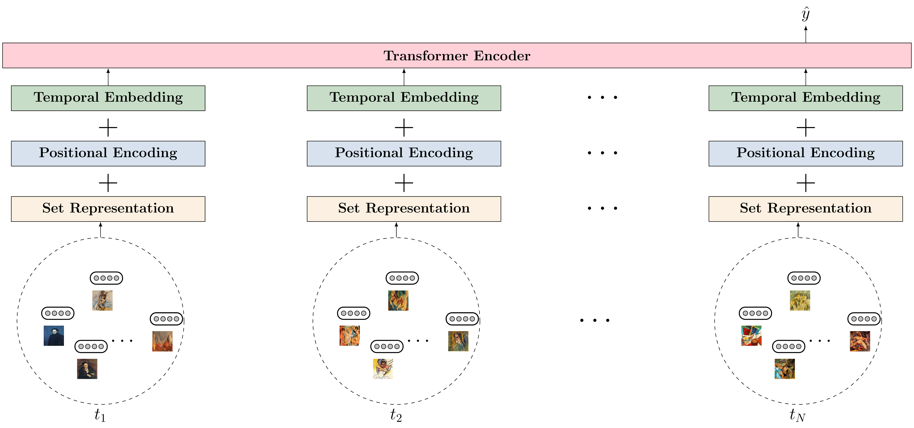

# Set2Seq-Transformer

[](https://www.python.org/downloads/)
[](https://pytorch.org/)
[](LICENSE)

Official PyTorch implementation of  
**"Set2Seq Transformer: Temporal and Position-Aware Set Representations for Sequential Multiple-Instance Learning"**  
*by Athanasios Efthymiou, Stevan Rudinac, Monika Kackovic, Nachoem Wijnberg, and Marcel Worring (University of Amsterdam)*

📄 **Paper**: [arXiv:2408.03404](https://arxiv.org/abs/2408.03404)
---

## Overview

**Set2Seq-Transformer** is a hierarchical deep learning model for *Sequential Multiple-Instance Learning (SMIL)* — problems where each input is a sequence of unordered sets and the model outputs a global sequence-level prediction.

Examples:
- **WikiArt-Seq2Rank**: Predicting artistic success from sequences of artworks  
- **Mesogeos**: Short-term wildfire danger forecasting  

The model combines permutation-invariant set encoders (DeepSets or SetTransformer) with temporal sequence encoders (Transformer or LSTM).

<p align="center">
  
</p>

---

## Datasets

### 1. WikiArt-Seq2Rank  
Predicting artistic success based on sequences of artworks.  
[Dataset README](datasets/wikiart_seq2rank/README.md)

### 2. Mesogeos (Short-term Wildfire Danger Forecasting)  
Forecasting near-future wildfire danger from spatiotemporal environmental features.  
[Dataset README](datasets/mesogeos/README.md)

---

## Quick Start

### WikiArt-Seq2Rank
```bash
python3 main.py \
    --dataset=wikiart_seq2rank \
    --model=Set2SeqTransformer \
    --set_model_name=DeepSets \
    --sequence_model_name=Transformer \
    --wikiart_split=stratified_split \
    --batch_size=16 \
    --epochs=100
```

### Mesogeos
```bash
python3 main.py \
    --dataset=mesogeos \
    --model=Set2SeqTransformer \
    --set_model_name=DeepSets \
    --sequence_model_name=Transformer \
    --temporal_embedding_type=timestamp_time2vec \
    --min_year=2006 \
    --max_year=2019 \
    --batch_size=32 \
    --epochs=50
```

The best model is automatically saved based on validation performance.

---

## Project Structure

```
set2seq-transformer/
├── set2seq/                 # Model and training code
│   ├── models/              # DeepSets, SetTransformer, LSTM, Transformer, Set2Seq
│   ├── main.py              # Main training entry point
│   ├── train_baselines.py   # Baseline models (e.g., XGBoost)
│   └── dataloader.py
├── datasets/                # WikiArt-Seq2Rank and Mesogeos data interfaces
├── configs/                 # YAML configs for reproducible experiments
├── assets/                  # Architecture figure
└── README.md
```

---

## Citation

If you use this code or datasets in your research, please cite:

```bibtex
@article{efthymiou2026set2seq,
  title={Set2Seq Transformer: Temporal and Position-Aware Set Representations for Sequential Multiple-Instance Learning},
  author={Efthymiou, Athanasios and Rudinac, Stevan and Kackovic, Monika and Wijnberg, Nachoem and Worring, Marcel},
  journal={arXiv preprint arXiv:2408.03404},
  year={2026}
}
```

---

## License

This project is licensed under the MIT License — see the [LICENSE](LICENSE) file for details.

---

**Questions or Issues?**  
Please contact the corresponding author or open an issue on the [GitHub repository](https://github.com/thefth/set2seq-transformer/issues).
